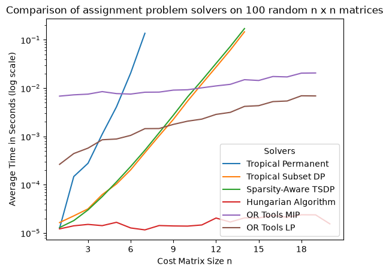
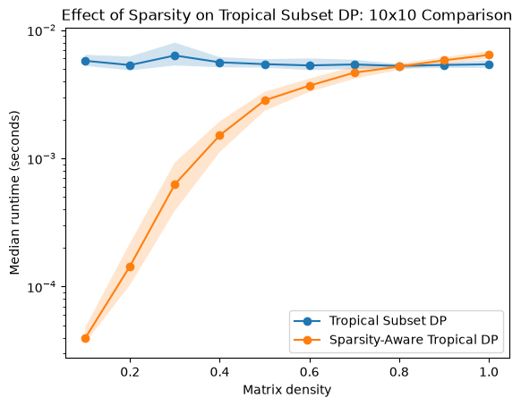
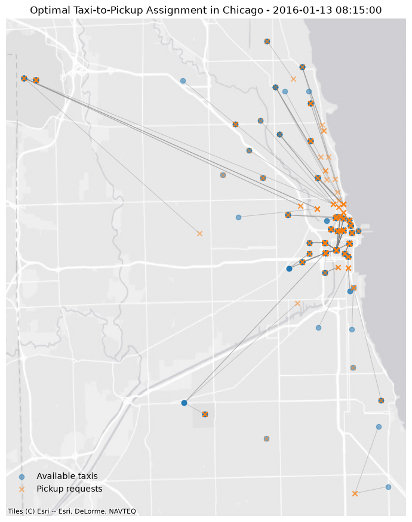

# Tropical Algorithms and the Assignment Problem

How does computational performance change as we progressively exploit more structure in an optimization problem?

I investigate this question through the assignment problem, beginning with its interpretation in tropical (min-plus) algebra and progressing from a naive recursive evaluation to dynamic programming, structure-aware pruning, and specialized optimization algorithms. Benchmarks show that the tropical perspective leads naturally to useful algorithmic improvements, but specialized assignment methods remain decisively faster. I then apply the assignment model to Chicago taxi data, translating raw trip records into a minimum-distance dispatch problem.


## Motivation

Imagine $n$ workers and $n$ jobs, and let $x_{ij}$ be the cost of assigning worker $i$ to job $j$. Each worker must be assigned to exactly one job and each job to exactly one worker, so an assignment corresponds to a permutation $\sigma \in S_n$. The assignment problem is to find the permutation that minimizes the total cost:

```math
\min_{\sigma \in S_n} \sum_{i=1}^n x_{i,\sigma(i)}.
```

This objective has a natural interpretation in **tropical (min-plus) algebra**. In ordinary arithmetic, the basic operations are addition and multiplication. In the min-plus setting, these are replaced by

```math
a \oplus b = \min(a,b),
\qquad
a \odot b = a+b.
```

To see the connection, let $X=(x_{ij})$ be an $n\times n$ matrix. Its classical permanent is

```math
\operatorname{perm}(X)
=
\sum_{\sigma\in S_n}
\prod_{i=1}^n x_{i,\sigma(i)}.
```

Replacing classical addition by minimum and multiplication by addition gives the **tropical permanent**

```math
\operatorname{tropperm}(X)
=
\min_{\sigma\in S_n}
\sum_{i=1}^n x_{i,\sigma(i)}.
```

This is exactly the optimal value of the assignment problem. In other words, a fundamental problem in combinatorial optimization can be viewed as evaluating a tropical analogue of a familiar matrix invariant.

This connection motivates the central question of this project:

> **What computational value, if any, comes from viewing the assignment problem through the tropical lens?**


## Methods

I compare several approaches to the assignment problem, ranging from a direct tropical computation to specialized and general-purpose optimization methods. The first three algorithms illustrate how progressively exploiting computational structure changes the problem: naive tropical recursion enumerates permutations, subset dynamic programming eliminates repeated subproblems, and a sparsity-aware variant additionally prunes infeasible assignments. I then compare these methods with a specialized assignment solver and standard LP and MIP formulations.

| Method | Description | Time Complexity |
|---|---|---:|
| **Naive tropical recursion** | Recursively evaluates the tropical permanent by expanding over possible assignments; essentially enumerates all permutations. | $O(n!)$ |
| **Tropical subset DP** | Memoizes optimal costs for subsets of assigned columns, avoiding repeated subproblems in the recursive expansion. | $O(n2^n)$ |
| **Sparsity-aware tropical DP** | Extends the subset DP by pruning transitions corresponding to forbidden assignments, exploiting sparse feasibility structure. | $O(n2^n)$ worst case |
| **Specialized assignment** | Solves the linear assignment problem using SciPy's `linear_sum_assignment`, exploiting the problem's specialized structure. | $O(n^3)$ |
| **Mixed-integer programming (MIP)** | Models each possible assignment with a binary variable and solves the resulting optimization problem with OR-Tools/SCIP. | General-purpose MIP; no polynomial worst-case guarantee |
| **Linear programming (LP)** | Solves the LP relaxation with OR-Tools/GLOP. For the assignment problem, total unimodularity guarantees an integral optimum. | Polynomial time* |

\* The LP formulation is polynomial-time solvable in theory; practical runtime depends on the LP algorithm and implementation.

Together, these methods provide a progression from factorial-time enumeration to dynamic programming and ultimately to polynomial-time methods that exploit the structure of the assignment problem.


## Results

To compare the computational behavior of the different methods, I benchmarked them on randomly generated assignment problems of increasing size. The experiments reveal a clear hierarchy: the naive tropical recursion is competitive only for very small problems before its factorial growth dominates, subset dynamic programming extends the range of tractable problem sizes substantially, and the specialized assignment solver is faster by a wide margin.

Because runtimes at these scales can be noisy, the results below report mean runtime across repeated trials.



 At \(n=7\), subset DP was approximately 312 times faster than naive recursion, while linear_sum_assignment was 27 times faster than subset DP.

The naive tropical method is initially fast because it has very little computational overhead, but its factorial growth quickly becomes prohibitive. Memoizing repeated subproblems changes the scaling dramatically: the tropical subset DP has complexity $O(n2^n)$ rather than $O(n!)$, allowing it to solve substantially larger instances.

The specialized assignment solver, however, is dramatically faster than either tropical approach. This reflects the advantage of exploiting the full combinatorial structure of the assignment problem rather than treating it as a generic tropical permanent computation. The LP formulation also performs substantially better than the MIP formulation, consistent with the fact that the assignment problem admits an integral LP relaxation.

### Exploiting sparsity

The subset DP improves on naive recursion by avoiding repeated subproblems, but it does not take advantage of structure within the cost matrix itself. To test whether additional structure could improve performance, I considered sparse assignment problems in which only a fraction of row-column pairs are feasible and modified the tropical DP to prune infeasible branches.



At density \(d=0.2\), feasibility-aware DP reduced median runtime from 0.005425 seconds to 0.000140 seconds, while the two methods converged as density approached 1.

Simply introducing sparse structure did not improve the ordinary tropical DP because the algorithm continued to evaluate infeasible transitions. Explicitly pruning forbidden assignments substantially improved performance on sparse instances, with the advantage disappearing as density approached one.


## Case Study: Chicago Taxi Assignment

To connect the algorithmic experiments to a real-world optimization setting, I applied the assignment model to data from the [Chicago Taxi Rides dataset](https://www.kaggle.com/datasets/chicago/chicago-taxi-rides-2016).
The goal is not to reconstruct Chicago's actual taxi dispatch system, but to formulate a simplified retrospective dispatch problem from real trip data: given a set of available taxis and a set of pickup requests, how should taxis be matched to requests to minimize total repositioning distance?

### From trip data to an assignment problem

For a selected time, I construct a set of available taxis using the ending locations of previous trips and a set of pickup requests using the starting locations of subsequent trips. This produces a cost matrix

```math
c_{ij} = \text{distance from available taxi } i \text{ to pickup request } j.
```

Distances are calculated using the Haversine formula, which gives straight-line geographic distance between latitude/longitude coordinates. Solving the resulting assignment problem with scipy.optimize.linear_sum_assignment then finds the one-to-one matching that minimizes total repositioning distance.

Several simplifying assumptions are important to the interpretation of this model:

- Retrospective rather than historical dispatch. Trip timestamps in the dataset are rounded to 15-minute intervals, so the exact sequence of taxi availability and pickup requests cannot be reconstructed. The optimization should therefore be interpreted as a hypothetical assignment within a snapshot, not a reconstruction of decisions actually made by Chicago taxi dispatchers.
- Straight-line distance as a cost proxy. Haversine distance is used as a simple proxy for repositioning cost. A production dispatch model would more realistically use road-network travel times and potentially incorporate traffic and other operational constraints.
- Aggregated geographic locations. The public dataset represents locations using spatially aggregated coordinates, so multiple trips can have exactly the same reported latitude and longitude. Consequently, a zero repositioning distance means that a taxi and request share the same reported location, not necessarily that they occupied precisely the same physical point.
- Simplified assignment model. The model optimizes only repositioning distance and does not incorporate factors such as driver availability, passenger wait-time constraints, road conditions, or other operational considerations that would matter in a production dispatch system.

For the snapshot shown below (January 13, 2016 at 8:15 AM), I identified 518 available taxis and constructed 518 candidate pickup requests from subsequent trips by those taxis. The average repositioning distances for different assignments are recorded below.

| Assignment          | Average repositioning distance |
| ------------------- | -----------------------------: |
| Optimized           |                    **0.65 mi** |
| Observed-trip proxy |                        1.56 mi |
| Random assignment   |                        3.21 mi |

The **observed-trip proxy** matches each taxi to a ride that it actually completed within the following hour. Because timestamps are rounded to 15-minute intervals, this ride cannot necessarily be identified as the taxi's immediate next trip.

Relative to random matching, the optimized assignment reduces estimated repositioning distance by approximately **80%**. Relative to the observed-trip proxy, it reduces estimated repositioning distance by approximately **58%**.


The map shows the available taxi locations, pickup requests, and the resulting minimum-distance assignments.




## Conclusions
For the assignment problems studied here, the tropical formulation did not produce a computational advantage over specialized classical algorithms. However, the tropical viewpoint provides a natural mathematical formulation and leads to a sequence of algorithmic improvements through recognition of repeated subproblems and exploitable feasibility structure.

The experiments illustrate a broader optimization lesson: structure improves computational performance only when the algorithm is designed to exploit it. Memoization transforms factorial enumeration into subset dynamic programming, explicit feasibility checks make sparse instances cheaper to solve, and a specialized assignment algorithm ultimately outperforms the more general approaches.

The Chicago taxi case study illustrates the complementary modeling side of operations research. Real-world optimization requires translating imperfect data into decision variables, costs, constraints, and explicit assumptions before an algorithm can be applied. In this setting, the optimization model substantially reduces estimated repositioning distance relative to the comparison assignments, while the limitations of the underlying data constrain how those results should be interpreted.

Overall, the project traces the assignment problem from mathematical formulation through algorithm design, computational benchmarking, and real-world optimization.

## Reproducing the analysis

The complete analysis is available in `notebooks/assignment_project.ipynb`.
Reusable solver implementations are contained in `src/solvers.py`.

Install dependencies with:

    pip install -r requirements.txt
